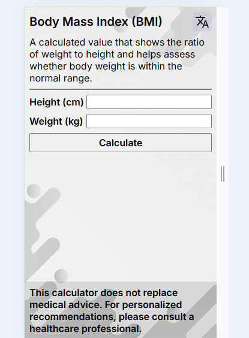
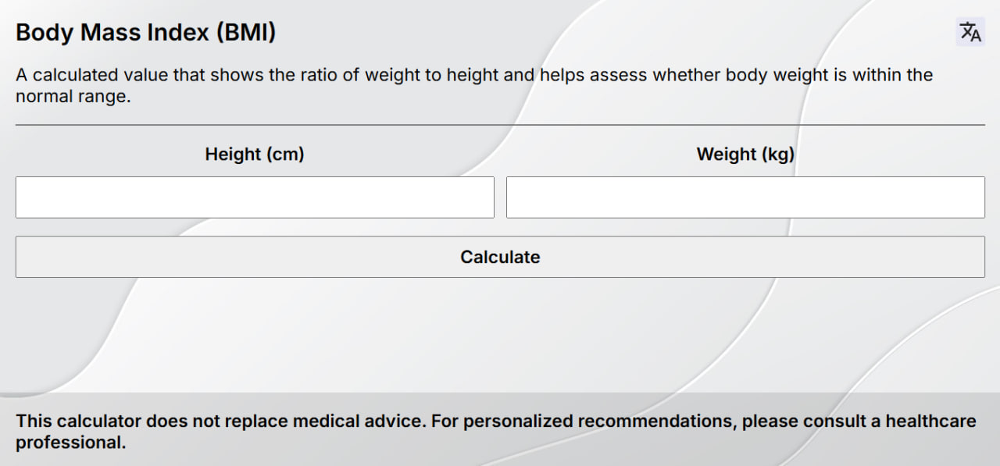

# BMI Calculator

A simple **Body Mass Index (BMI) Calculator** built with **HTML, CSS, and JavaScript**.  
It calculates BMI based on height and weight and provides interpretation (underweight, normal, overweight, etc.).

---

## 🚀 Features
- Input height and weight
- Automatic BMI calculation
- Result interpretation (underweight, normal, overweight, obesity)
- Responsive design (works on desktop and mobile)

---

## 📸 Screenshots
| Desktop | Mobile |
|---------|--------|
|  |  |

---

## 🛠️ Technologies Used
- HTML5
- CSS3 (Flexbox / responsive layout)
- Vanilla JavaScript

---

## 📦 Installation & Usage
1. Clone the repository:
   ```bash
   git clone https://github.com/lsteelanxietyl/bmi-calculator.git

2. Open index.html in your browser.
(No additional setup required)
